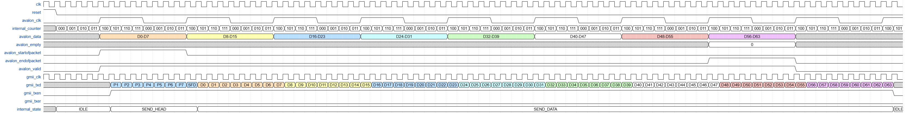

# GMII predajni interfejs

## Opis projekta 
Fokus projekta je na modeliranju i implementaciji GMII predajnog interfejsa, koji putem ulaznog 64-bitnog Avalon-ST interfejsa prima odlazni Ethernet okvir (počinje odredišnom adresom a završava FCS poljem), te na izlazni GMII interfejs generiše preambulu, SFD te oktete odlaznog Ethernet okvira.

## Uvod
**GMII** (eng. *Gigabit Media-Independent Interface*) je standardizirano sučelje definisano od strane IEEE 802.3 za povezivanje Media Access Control (MAC) sloja i fizičkog sloja (PHY) u Gigabit Ethernet mrežama. Dizajniran je da bude nezavisan od vrste fizičkog medija, omogućavajući univerzalnu komunikaciju između različitih uređaja [1]. Podaci se prenose u oktetima od LSB prema MSB [2], pri čemu se za generisanje takta koristi frekvencija od 125 MHz. GMII podržava prenos podataka brzinom od 1 Gbps u oba smjera (full-duplex), što ga čini ključnim za postizanje visokih performansi i interoperabilnosti u mrežnim sistemima. Također, omogućava lakšu integraciju različitih PHY uređaja sa MAC slojevima, čime se pojednostavljuje razvoj i implementacija mreža [1]. Logika se obavlja na uzlaznu ivicu taktnog signala.

**Avalon-ST** (*Avalon Streaming Interface*) predstavlja jedan od ključnih standarda unutar Avalon interfejsa, dizajniran za prenos podataka u jednom smjeru, uključujući višekanalne tokove, pakete i podatke za digitalnu obradu signala (DSP). Podržava sekvencijalni prenos podataka, sa ili bez *backpressure* mehanizma, te omogućava visoke brzine prenosa u sklopu FPGA dizajna. Karakterišu ga fleksibilnost u oblikovanju paketa podataka, podrška za različite režime toka podataka (sink i source), te mogućnost kontrole prenosa pomoću signala kao što su *valid*, *ready*, i *startofpacket/endofpacket*. Široko se koristi u aplikacijama kao što su mrežni procesori, DSP sistemi i prilagođeni hardver za obradu podataka [3].

## Opis ulaznih i izlaznih signala

Ulazni signali u modul su dati u tablici ispod.

|Signal|Opis|
|--|:-----:|
|avalon_data [63:0]	|Signal koji sadrži podatke koji se prenose.|
avalon_valid|	Indikator validnih podataka|
avalon_empty|	Indikator broja simbola koji su ostali prazni prilikom prenosa.|
avalon_endofpacket|	Indikator kraja paketa.|
avalon_startofpacket|	Indikator početka paketa.|
reset|	Signal za reset|
clk|	Clock signal frekvencije 125 MHz|

Izlazni signali modula su dati u tablici ispod:
|Signal|Opis|
|------------|:-----:|
gmii_txd [7:0]|	Transmitirani podaci|
gmii_txen|	Indikacija aktivne transmisije|
gmii_clk|	Clock signal frekvencije 125 MHz|
avalon_clk|	Clock signal frekvencije 125/8 MHz|

Za opis signala korišteni su opisi Avalon-ST sučelja, te GMII sučelja, koji se mogu pronaći u [2] i [3].

## Način rada
Način rada modula opisan je sljedećim dijagramima:

Scenario 1: Transmisija podataka čija je dužina djeljiva sa 8 bez ostatka.

Scenario 2: Transmisija podataka čija je dužina djeljiva sa 8 sa ostatkom.

Scenario 3: Transmisija podataka uz period nevalidnih podataka tokom transmisije.

## Konačni automat 

# Literatura
[1] B. Cheng, "Implementing GMII Interface on C-5," C-PORT CORPORATION, Rev. 1.1, Dec. 2, 2001. Dostupno: www.freescale.com.

[2] E.Kaljić, "Predavanje 7" iz predmeta Arhitekture paketskih čvorišta, ak. 2024/2025.

[3] Avalon Interface Specification, Intel Quartus Prime Design Suite 20.1, v2022.01.24
