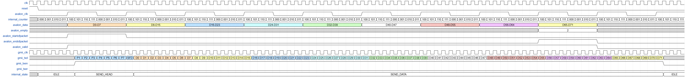

# Opis projekta 
Fokus projekta je na modeliranju i implementaciji GMII (*Gigabit Media-Independent Interface*) predajnog interfejsa, koji putem ulaznog 64-bitnog Avalon-ST interfejsa prima odlazni Ethernet okvir (počinje odredišnom adresom a završava FCS poljem), te na izlazni GMII interfejs generiše preambulu, SFD te oktete odlaznog Ethernet okvira.

GMII (eng. *Gigabit Media-Independent Interface*) je sučelje za prenos podataka između MAC i PHY kontrolera. Podaci se prenose u oktetima od LSB prema MSB, pri čemu se za generisanje takta koristi frekvencija 125 MHz [1]. Logika se obavlja na uzlaznu ivicu taktnog signala.
# Opis ulaznih i izlaznih signala
Označimo komponentu koju modeliramo i imamo za cilj implementirati sa MY_GMII_TX. 

Ulazni signali u modul su dati u tablici ispod.

|Signal|Opis|
|--|:-----:|
|avalon_data [63:0]	|Signal koji sadrži podatke koji se prenose.|
avalon_valid|	Indikator validnih podataka|
avalon_empty|	Indikator broja simbola koji su ostali prazni prilikom prenosa.|
avalon_endofpacket|	Indikator kraja paketa.|
avalon_startofpacket|	Indikator početka paketa.|
reset|	Signal za reset|
clk|	Clock signal frekvencije 125 MHz|

Izlazni signali modula su dati u tablici ispod:
|Signal|Opis|
|------------|:-----:|
gmii_txd [7:0]|	Transmitirani podaci|
gmii_txen|	Indikacija aktivne transmisije|
gmii_clk|	Clock signal frekvencije 125 MHz|
avalon_clk|	Clock signal frekvencije 125/8 MHz|

Za opis signala korišteni su opisi Avalon-ST sučelja, te GMII sučelja, koji se mogu pronaći u [1] i [2].

# Način rada
Način rada modula opisan je sljedećim dijagramima:

Scenario 1: Transmisija podataka čija je dužina djeljiva sa 8 bez ostatka.

Scenario 2: Transmisija podataka čija je dužina djeljiva sa 8 sa ostatkom.

Scenario 3: Transmisija podataka uz period nevalidnih podataka tokom transmisije.

# Konačni automat 

# Literatura
[1] E.Kaljić, "Predavanje 7" iz predmeta Arhitekture paketskih čvorišta, ak. 2024/2025.

[2] Avalon Interface Specification, Intel Quartus Prime Design Suite 20.1, v2022.01.24
